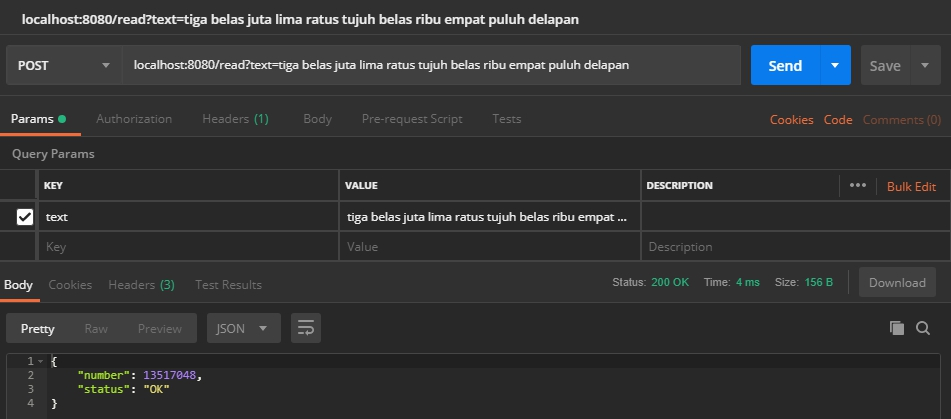
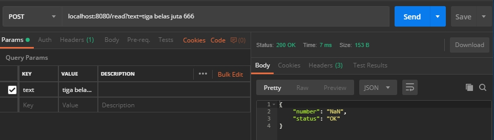
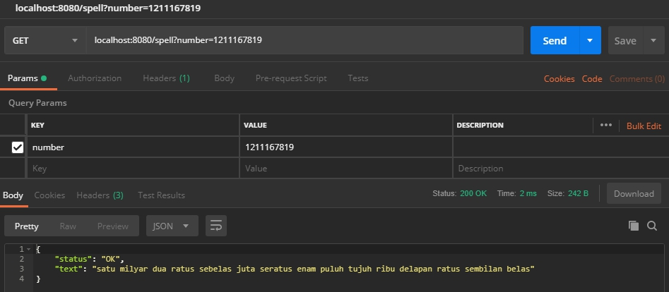
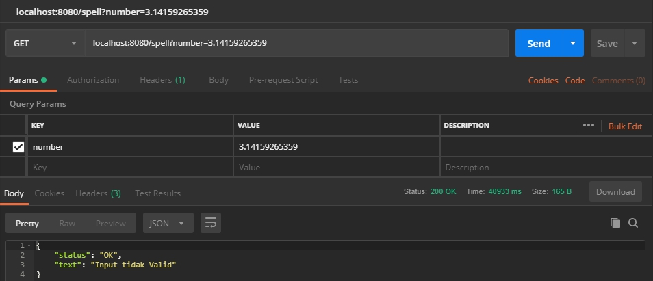

<h1>Indonesian Numeral Speller</h1>
by Leonardo / 13517048 - Calon IRK 2019
<h2>Fungsi Program</h2>

Berikut adalah fungsi dan prosedur yang terdapat pada file source code
- <u>function</u> oneToEleven(angka : <u>integer</u>) -> string
- <u>function</u> TwelvetoBillion(angka : <u>integer</u>) -> string
- <u>function</u> IntToString(angka : <u>integer</u>) -> string<br>
{fungsi utama pengubahan dari integer menjadi string}
- <u>function</u> find(arr : <u>array of</u> string, val : string) -> <u>integer</u><br>
{mengembalikan kemunculan pertama elemen val pada arr}
- <u>function</u> baseStringToInt(kata : string) -> <u>integer</u>
- <u>procedure</u> normalize(arr : <u>array of</u> string)
- <u>function</u> getNum(arr_kata : <u>array</u> [0..12] <u>of</u> string) -> <u>integer</u>
- <u>function</u> StringToInt(kata : string) -> <u>integer</u><br>
{fungsi utama pengubahan dari string menjadi integer}
- <u>procedure</u> methodPOST(gc : gin.Context)<br>
{prosedur untuk fitur POST}
- <u>procedure</u> methodGET(gc : gin.Context)<br>
{prosedur untuk fitur GET}

<h2>Cara menjalankan</h2>
Requirements:<br>

- Pada komputer anda terinstalasi compiler bahasa pemrograman go (dapat dilihat di https://golang.org/doc/install).
- Pada komputer anda terinstalasi library bahasa GO: gin dan cors (install dengan command ```go get -u github.com/gin_gonic/gin``` dan ```go get -u github.com/gin_contrib/cors```).
- Memiliki aplikasi POSTMAN.

Langkah penjalanan program:<br>

- Masuk ke direktori mainprog.go disimpan.
- Jalankan perintah ```go run mainprog.go```.
- Buka pada Aplikasi POSTMAN dan buka ```localhost:8080``` (tempat Rest API dijalankan).
- <b>CONVERTING</b>
    - Untuk pengubahan String ke Integer, pindahkan method ke ```POST``` dan Send ```localhost:8080/read?text=<isi string anda>```.
    - Untuk pengubahan Integer ke String, pindahkan method ke ```GET``` dan Send ```localhost:8080/spell?number=<isi angka anda>```.
- Lihat hasilnya pada Body hasil status pengerjaan.
- <b>WiP: program ini dapat dijalankan di sebuah aplikasi web/mobile.</b>

<h2>Contoh request and response</h2>
Gambar 1: POST dan input valid:<br>

<br>

Gambar 2: POST dan input tidak valid:<br>

<br>

Gambar 3: GET dan input valid:<br>

<br>

Gambar 4: GET dan input tidak valid:<br>

<br>

<h2>Arsitektur kode Go</h2>

```
$GOPATH
|---src
    |---bufio
    |   |---*lib
    |
    |---fmt
    |   |---*lib
    |
    |---github.com
    |   |---Indonesian-Numeral-Spellers
    |   |   |---src
    |   |   |   |---mainprog.go
    |   |   |
    |   |   |---Test
    |   |   |   |---*screenshot hasil
    |   |   |
    |   |   |---README.md
    |   |
    |   |---gin_contrib
    |   |   |---cors
    |   |       |---*lib
    |   |
    |   |---gin_gonic
    |   |   |---gin
    |   |       |---*lib
    |   
    |---os
    |   |---*lib
    |
    |---strconv
    |   |---*lib
    |
    |---strings
    |   |---*lib
```
*beberapa directory/file yang tidak dirasa penting untuk dicantumkan tidak dicantumkan<br>
*beberapa directory/file yang tidak dirasa penting untuk dijelaskan tidak dijelaskan